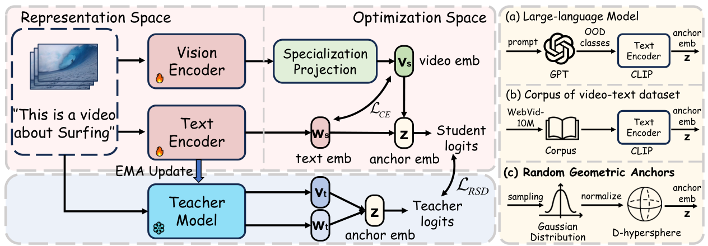

<h2 align="center">[NeurIPS' 2026] TACO: Towards Task-Consistent Open-Vocabulary Adaptation in Video Recognition</h2>

[](https://nips.cc/Conferences/2026) [](https://arxiv.org/pdf/2606.25478)

## Overview

Official implementation of **TACO**, a simple and effective framework for **task-consistent open-vocabulary video adaptation**. TACO adapts CLIP to video recognition while preserving the transferable representation structure needed to recognize unseen categories.

Standard fine-tuning optimizes representations within the training distribution, whereas open-vocabulary evaluation requires generalization beyond it. TACO addresses this inconsistency through two complementary designs:

- **Relative Structure Distillation (RSD):** preserves teacher-consistent geometry through random geometric anchors sampled on the CLIP hypersphere, regularizing relations beyond the training categories without collecting additional OOD data. 
- **Specialization Projection:** decouples the representation space from the optimization space using a lightweight residual linear projection.

<p align="center">
  
</p>

## 📬 Requirements

The reference environment is documented in [env.md](env.md):

- Python 3.10.12
- PyTorch 2.0.1 with CUDA 11.8 and compatible torchvision
- PyYAML, dotmap, decord, torchnet, tqdm, termcolor, ftfy, regex, pandas

## 🔗 Data Preparation

#### Datasets

- **Kinetics-400:** used for cross-dataset adaptation.
- **UCF-101, HMDB-51, and Kinetics-600:** used for cross-dataset zero-shot evaluation. Each Kinetics-600 evaluation split contains 160 classes sampled from the 220 classes unseen in Kinetics-400.

For Kinetics downloads, see [CVDF](https://github.com/cvdfoundation/kinetics-dataset). UCF-101 and HMDB-51 are available from their [UCF-101](https://www.crcv.ucf.edu/data/UCF101.php) and [HMDB-51](https://serre-lab.clps.brown.edu/resource/hmdb-a-large-human-motion-database/) dataset pages.


#### Video Loader

By default, videos are decoded on the fly using **decord**. Annotation lists and label CSV files are provided in [lists](lists).

<details>
<summary>Example of a video annotation list</summary>

```text
abseiling/aaa.mp4 0
abseiling/bbb.mp4 0
```

Each line contains a video path relative to the configured data root and its integer class label. Labels must match the corresponding label CSV.

</details>


## 🐱 Model Zoo

Evaluation uses **8 frames at 224 × 224 resolution** and **3 temporal clips × 1 spatial crop** per video.

| Architecture | UCF-101 | HMDB-51 | Kinetics-600 | Checkpoint | Config |
| :---: | :---: | :---: | :---: | :---: | :---: |
| ViT-B/16 | 85.6&nbsp;±&nbsp;1.2 | 60.0&nbsp;±&nbsp;0.5 | 77.0&nbsp;±&nbsp;0.9 | — | [config](configs/k400/k400_train_video_vitb-16-f8.yaml) |
| ViT-L/14 | 91.4&nbsp;±&nbsp;0.7 | 64.2&nbsp;±&nbsp;0.8 | 83.9&nbsp;±&nbsp;0.7 | — | [config](configs/k400/k400_train_video_vitl-14-f8.yaml) |


## 🚤 Training

Train on Kinetics-400 on a single machine:

```bash
# ViT-B/16, 8 frames
bash scripts/run_train.sh configs/k400/k400_train_video_vitb-16-f8.yaml

# ViT-L/14, 8 frames
bash scripts/run_train.sh configs/k400/k400_train_video_vitl-14-f8.yaml
```


## 🌊 Evaluation

Evaluate on the three splits of UCF-101, HMDB-51, and Kinetics-600 using **3 × 1 views**, with 8 frames per view. Replace `TACO_B16.pt` with your checkpoint path and set `network.arch` in each config to match the checkpoint.

```bash
# UCF-101
bash scripts/run_test_zeroshot.sh configs/splits/ucf_split1.yaml TACO_B16.pt --test_clips 3

# HMDB-51
bash scripts/run_test_zeroshot.sh configs/splits/hmdb_split1.yaml TACO_B16.pt --test_clips 3

# Kinetics-600
bash scripts/run_test_zeroshot.sh configs/k600/k600_zs_test_split1.yaml TACO_B16.pt --test_clips 3
```


## 📌 BibTeX & Citation

If you find this work useful, please consider citing our manuscript:

```bibtex
@inproceedings{TACO2026,
  title={TACO: Towards Task-Consistent Open-Vocabulary Adaptation in Video Recognition},
  author={Zhu, Minghao and Lin, Xiao and Hu, Mengxian and Zhou, Xun and Wang, Liuyi and Qi, Xiaoyan and Liu, Chengju and Chen, Qijun},
  booktitle={Advances in Neural Information Processing Systems (NeurIPS)},
  year={2026}
}
```

## 📝 Acknowledgement

Our implementation builds on [MoTE](https://github.com/ZMHH-H/MoTE), [BIKE](https://github.com/whwu95/BIKE), and [CLIP](https://github.com/openai/CLIP). We thank their authors for sharing their code and research.
